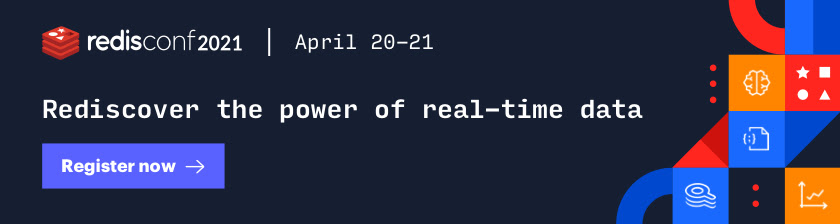
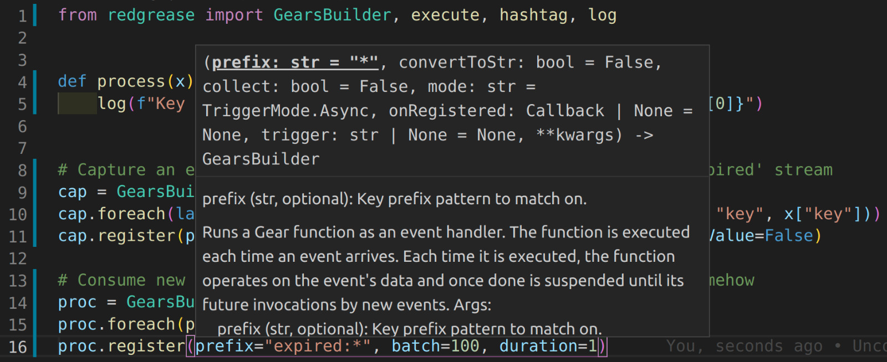

[](https://redislabs.com/modules/redis-gears/)
[](https://mit-license.org/)
[](https://pypi.org/project/redgrease/#history)
[](https://pypi.org/project/redgrease)
[](https://pypi.org/project/redgrease)
[](https://www.python.org/)
[](https://lgtm.com/projects/g/lyngon/redgrease/context:python)
[](https://lgtm.com/projects/g/lyngon/redgrease/alerts/)
[](https://github.com/lyngon/redgrease/actions/workflows/full_tests.yml)
[](https://redgrease.readthedocs.io/en/latest/?badge=latest)
[](https://codecov.io/gh/lyngon/redgrease)
[](https://libraries.io/pypi/redgrease)
[](https://github.com/lyngon/redgrease/pulls?q=is%3Apr+is%3Aclosed)
[](https://github.com/lyngon/redgrease/issues?q=is%3Aissue+is%3Aopen+label%3Abug)
[]()
[](https://github.com/lyngon/redgrease/pulse)
[](https://github.com/psf/black)
[](https://hub.docker.com/r/lyngon/redgrease)
[](https://www.youtube.com/watch?v=hGlyFc79BUE)
[](https://www.python.org/)

<!--
Author: Anders Åström
Contact: anders@lyngon.com
-->

<!--
The MIT License

Copyright © 2021 Lyngon Pte. Ltd.

Permission is hereby granted, free of charge, to any person obtaining a copy of this
 software and associated documentation files (the “Software”), to deal in the Software
 without restriction, including without limitation the rights to use, copy, modify,
 merge, publish, distribute, sublicense, and/or sell copies of the Software, and to
 permit persons to whom the Software is furnished to do so, subject to the following
 conditions:

The above copyright notice and this permission notice shall be included in all copies
 or substantial portions of the Software.

THE SOFTWARE IS PROVIDED “AS IS”, WITHOUT WARRANTY OF ANY KIND, EXPRESS OR IMPLIED,
 INCLUDING BUT NOT LIMITED TO THE WARRANTIES OF MERCHANTABILITY, FITNESS FOR A
 PARTICULAR PURPOSE AND NONINFRINGEMENT. IN NO EVENT SHALL THE AUTHORS OR COPYRIGHT
 HOLDERS BE LIABLE FOR ANY CLAIM, DAMAGES OR OTHER LIABILITY, WHETHER IN AN ACTION OF
 CONTRACT, TORT OR OTHERWISE, ARISING FROM, OUT OF OR IN CONNECTION WITH THE SOFTWARE
 OR THE USE OR OTHER DEALINGS IN THE SOFTWARE.
-->

## Register to RedisConf 2021 and catch the session on RedGrease
<a href="https://bit.ly/3s3n8zj" >
    
</a>

Registrations are free!


# RedGrease
RedGrease is a Python package and set of tools to facilitate development against [Redis](https://redis.io/) in general and [Redis Gears](https://redislabs.com/modules/redis-gears/) in particular.

It may help you create:
- Advanced analytical queries,
- Event based and streaming data processing,
- Custom Redis commands and interactions,
- And much, much more...

... all written i Python and running distributed ON your Redis nodes.

## Documentation
Full documentation (WIP) [here](https://redgrease.readthedocs.io).

## Installation
- [Client](#client-installation) - I.e. Package used by application and/or during dev.
- [Runtime](#runtime-installation) - I.e. Package installed on the Redis engine.


## RedGrease consists of the followinig, components:

1. [A Redis / Redis Gears client](https://redgrease.readthedocs.io), which is an extended version of the [redis](https://pypi.org/project/redis/) client, but with additional pythonic functions, mapping closely (1-to-1) to the Redis Gears command set (e.g. `RG.PYEXECUTE`, `RG.GETRESULT`, `RG.TRIGGER`, `RG.DUMPREGISTRATIONS` etc), outlined [here](https://oss.redislabs.com/redisgears/commands.html)
```python
import redgrease

gear_script = ... # Some vanilla Gear script string, a GearFunction object or a script file path.

rg = redgrease.RedisGears()
rg.gears.pyexecute(gear_script)  # <--
```

2. Wrappers for the [runtime functions](https://redgrease.readthedocs.io) (e.g. `GearsBuilder`, `GB`, `atomic`, `execute`, `log` etc) that are automatically loaded into the server [runtime environment](https://oss.redislabs.com/redisgears/runtime.html). These placeholder versions provide **docstrings**, **auto completion** and **type hints** during development, and does not clash with the actual runtime, i.e does not require redgrease to be installed on the server.


3. [Servers-side Redis commands](https://redgrease.readthedocs.io), allowing for **all** Redis (v.6) commands to be executed on serverside as if using a Redis 'client' class, instead of 'manually' invoking the `execute()`. It is basically the [redis](https://pypi.org/project/redis/) client, but with `execute_command()` rewired to use the Gears-native `execute()` instead under the hood. 
```python
import redgrease
import redgrease.utils
import requests

def download_image(record):
    image_key = record.value["image"]
    if redgrese.cmd.hget(image_key, "image_data"): # <-
        # image already downloaded
        return image_key
    image_url = redgrease.cmd.hget(image_key,"url") # <-
    image_data = requests.get(image_url)
    redgrease.cmd.hset(image_key, "image_data", # <-
     images_data)
    return image_key

redgrease.GB(redgrease.ReaderType.KeysReader, "annotation:*").map(redgrease.utils.record).foreach(download_image).run()
```

4. First class [GearFunction objects](https://redgrease.readthedocs.io), inspired by the remote builders of the official [redisgears-py](https://github.com/RedisGears/redisgears-py) client, but with some differences.
```python
import redgrease
from redgrease.utils import as_is

# Dummy processing of command argument
def process(x):
    log(f"Processing argument '{x}'")
    return len(str(x))

# Gear Function object
gear = CommandReader().flatmap(as_is).map(process).register(trigger="launch")

# Redis client with Gears
rg = redgrease.RedisGears()

# Register the gear function on a cluster
gear.on(rg) 
# same as rg.gears.pyexecute(gear)

# Trigger the function
rg.gears.trigger("launch", "the", "missiles!")
# [8, 3, 6]
```
:warning: As with the official package, this require that the server runtime Python version matches the client runtime that defined the function. As of writing this is Only for Python 3.7.

5. [CLI tool](https://redgrease.readthedocs.io) running and or loading of Gears scripts onto a Redis Gears cluster. Particularls useful for "trigger-based" CommandReader Gears.
It also provides a simple form of 'hot-reloading' of Redis Gears scripts, by continously monitoring directories containing Redis Gears scripts and automatically 'pyexecute' them on a Redis Gear instance if it detects modifications. 
The purpose is mainly to streamline development of 'trigger-style' Gear scripts by providing a form of hot-reloading functionality.
```
redgrease --server 10.0.2.21 --watch scripts/
```
This will 'pyexecute' the gears scripts in the 'scripts' directory against the server. It will also watch the directors for changes and re-execute the scripts if they have been modified.

6. Other boilerplate or otherwise functions and utilities (`redgrease.utils`), that are commonly used in gears. e.g:
    - A record `record` function  that can be used to transform the default `KeysReader` dict to an `Records` object with the appropriate attributes.
    - CommandReader + Trigger function decorator, that makes custom Redis Commands really easy.
    - Helpers to aid debugging and/ or testing of gears. 
    - ... 

Additional feature suggestions appriciated.

7. Docker images with redgrease pre-installed as well as, hopefully, variants for all python versions 3.6 or later (Work-in-Progress).


## Example usage:
```python
import redgrease
import redgrease.utils

relevant_usr_fields = {
    "active": bool,
    "permissions": redgrease.utils.list_parser(str),
}

# # Partial Gear function
# Extracting a dict for every 'active' user
active_users = (
    redgrease.KeysOnlyReader("user:*")
    .map(lambda key: redgrease.cmd.hmget(key, *relevant_usr_fields.keys()))
    .map(
        lambda udata: redgrease.utils.to_dict(
            udata, keys=relevant_usr_fields.keys(), val_transform=relevant_usr_fields
        )
    )
    .filter(lambda usr: usr["active"])
)
# # Partial Gear function re-use
# Count the number of active users
active_user_count = active_users.count()

# Get all the distinct user permissions
all_issued_permissions = active_users.flatmap(lambda usr: usr["permissions"]).distinct()

# # Redis Client w. Gears-features can be created separately
r = redgrease.RedisGears()

# # Two ways of running:
# With 'pyexecute' ...
count = r.gears.pyexecute(active_user_count.run())
# ... or with the 'on' metod 
permissions = all_issued_permissions.run().on(r)

# Result values are directly accessible
print(f"Count: {count}")
if count > 100:
    print("So many users!")
print(permissions)
if "root" in permissions:
    print("Someone has root permissions")

# Errors can be accessed too
if count.errors:
    print(f"Errors counting users: {count.errors}")
if permissions.errors:
    print(f"Errors collecting permissions: {permissions.errors}")
```

# Installation
Redgrease may be installed either as a developmet tool only, a client library and/or as a runtime library on the Redis Gears server.
It can be installed with different 'extras' dependencies depending on preferred usage. 


## Client Installation
Installaton for development and/or client application environment.

In the environment where you develop your Gears scripts, simply install 'redgrease' with pip3, as usual:
```
python3 -m pip install redgrease[all]
```
This installs all the dependencies, allowing for the full features set.


`reagrease[cli]` : Installs dependencies for the CLI


## Runtime Installation
Installation for the Redis Gearh Runtime / Server.

### Server Requirements
Firstly, the Redis Engine must be running the Redis Gears module. 
The absolute easiest way to get started is to run either of the pre-packaged Docker images, either:

```
docker run -p 6379:6379 redislabs/redisgears
```
For a single Redis engine setup with Gears.

Alternatively,
```
docker run -p 30001:30001 -p 30002:30002 -p 30003:30003 redislabs/rgcluster
```
For a three master node cluster of Redis engines with Gears.

For more advanced deployments of Redis with Gears, please refer to the [official Gears installation documentation](https://docs.redislabs.com/latest/modules/redisgears/installing-redisgears/).

### Redgrease Runtime Package
As for RedGrease, it is recommended to use the `redgreese[runtime]` package as a serverside dependency. 
This installs dependencies for the all the serverside features such as serverside Redis commands and the runtime for gears constructed with the 'Remote Gears Builder

The easiest way of installing the latest stable runtime package is by simply setting the `enforce_redgrease` argument of `pyexecute` to `True`.
Redgrease will also be automatically enforced when executing any dynamically constructed GearFunction objects. 

```python
import redgrease

rg = redgrease.RedisGears()
rg.gears.pyexecute(enforce_redgrease=True)
```
Note that is is possible to specify a specic (pinned) version, with or without 'extras' instread of `True`, if desired.

## Extras
The current 3rd party packages in the `runtime` extras are:
- [attrs](https://pypi.org/project/attrs/) - For parsing composite Gears response structures into attrs objects
- [redis](https://pypi.org/project/redis/) - Needed for server-side redis commands
- [cludpickle](https://pypi.org/project/cloudpickle/) - Needed for the "Remote" gears (similarly to the official [redisgears-py](https://github.com/RedisGears/redisgears-py) client)

### Note on the runtime environment
If the only thing you need is the redgrease client and/or docstings, typhints and the loader CLI for development of conventional Gears scripts (i.e that only use the standard commands and loaded as strings), **then the RedGrease package is not strictly required to be installed** in the Redis Gears Python Runtime environment (i.e. on the server)  

You can in this case simply remove the redgrease import clause from your script, after development but before `pyexecuting` them as per the [Redis Gears documentation](https://oss.redislabs.com/redisgears/intro.html). Such scripts will still run perfectly fine without redgrease in Redis Gears Environment.

A minimal install, without any  3-rd party dependencies, which is pretty much only the syntactic sugar and runtime placeholders, can be installed usig the bare 'redgrease' package. 

This migth be useful if you really don't want the 3rd party packages in the server runtime but still want to use the redgrese sugar.

You can also use the RedGrease watcher or loader CLI to automate loading your scripts as well as requirements from a normal 'requirements.txt' files, as outlined [here](https://github.com/lyngon/redgrease) 

# Usage / Documentation
The Documenttion is work-in-progress, but the latest and greatest version is available here: 
## https://redgrease.readthedocs.io

Go read the docs!
# Testing
Tests are separate from the package, but are available in the [GitHub repo](https://github.com/lyngon/redgrease).
```
git clone https://github.com/lyngon/redgrease
``` 

In order to run the tests, [Docker](https://docs.docker.com/get-docker/) is required to be installed in order to spin up fresh Redis instances, on demand for the tests. 

PyTest and quite a number of its add-ons, as well as Tox, is also needed to run the tests properly. All test (and dev) requirements is best installed through:
```
cd redgrease/
python3 -m venv .venv
source .venv/bin/activate
pip install -r src/requirements-dev.txt
```
Then the tess can be run with PyTest as per usual:
```
pytest 
```

**Note:** Running the tests takes excruciatingly long, sas a new fresh Redis instance is spun up **for each test**, just to ensure no risk of cross-contamination. This may be optimized, as many tests are actually independent, but it's left like this for now.

# Why This?
The need for this arose from wanting to prototype the concepts for a new Redis module, using Gears CommandReaders and triggers instead of having to write full fledged module in C.

Intitially RedGrease was just a very simple module, with placeholders for the default Redis gears runtime functions, with type hints and docstrings, just to make it more convenient and less error prone to write Gears functions.

Then the loader cli was created, in order to furthure speed up the rapid development cycle. 

Then the server-side Redis 'client' commands function was addes to minimize errors (E.g. mispelled command strings).

Then the client was added ... and before long it started to get a life of its own. 

Note that this means RedGrease package is primarily intended to be an aid for **development** of Gears scripts, and was not originally intended to be used in any "production" software. 

This intent has now changed, and the new goal is now to make Redgrease a production grade package for Redis Gears.
Granted, there is stilll quite some way to go to get there, so your support and feedback is greatly appriciated.

If you like this project, or want professional support, please consider [sponsoring](https://github.com/sponsors/lyngon).