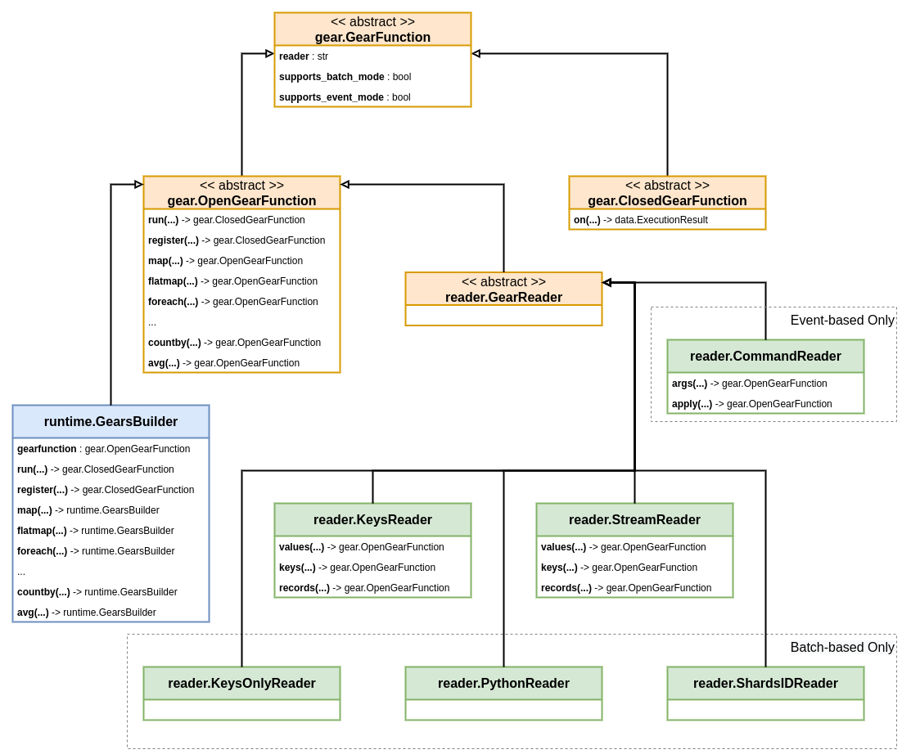

.. include :: banner.rst

.. _gearfun:

GearFunction
============

GearFunction objects are RedGrease's representation of RedisGears Gear functions.
There are a couple of different classes of GearFunctions to be aware of.

    UML Relationships between different GearFunction 

These function objects can be dynamically constructed in either your application code or in separate script files. They are constructed using either the :ref:`gearfun_builder` (blue) or any of the :ref:`gearfun_readers` (green):

- :ref:`gearfun_reader_keysreader`
- :ref:`gearfun_reader_keysonlyreader`
- :ref:`gearfun_reader_streamreader`
- :ref:`gearfun_reader_pythonreader`
- :ref:`gearfun_reader_shardsidreader`
- :ref:`gearfun_reader_commandreader`

These are responsible for reading data from different sources into records, either in batch on-demand or when some event occurs. 

GearFunctions are created by "applying" :ref:`operations`, such as :ref:`op_map`, :ref:`op_groupby`, :ref:`op_aggregate` etc, to either any of the :ref:`gearfun_readers`, a :ref:`gearfun_builder`,  or some other GearFunction.

With the exception of the :ref:`gearfun_builder`, "applying" an operation on a GearFunction, doesn't actually modify it, but instead creates a new function with that operation added. 

All Gear functions therefore consists of a chain of zero or more :ref:`operations`, with some reader at the begining. 

Some of the Reader types have additional reader-specific operations, that can only be "applied" as as their first operation.

Gear functions are "terminated" by either one of two special :ref:`op_action`. Either :ref:`op_action_run`, for immediate "batch-mode" execution, or :ref:`op_action_register`, for registering the function for "event-mode" execution.

Some Readers support both "batch-mode" and "event-mode", but some only support one of the modes.

GearFunctions that **have not** been "terminated" by either of the :ref:`op_action`, are referred to as an :ref:`gearfun_open`, as they **can be extended** with more operations, creating new GearFunctions. 

GearFunctions that **have** been "terminated" by either of the :ref:`op_action`, are referred to as a :ref:`gearfun_closed`, as they **cannot be extended** with more operations, creating new GearFunctions, but they can be executed. 

.. note::
    
    This "open/closed" terminology is not explicitly used by RedisLabs in their `RedisGears Function Documentation <https://oss.redislabs.com/redisgears/1.0/functions.html>`_, but it was the most intuitive terminology I could think of, to describe how their design of GearsBuilder actually behaves. 

    Early versions of RedGrease used the term "partial" instead of "open". This was deemed a bit confusing, because "`partial functions <https://en.wikipedia.org/wiki/Partial_function>`_" is a very specific, but completely different, thing in mathematics. It was also sometimes confused with "`partial application <https://en.wikipedia.org/wiki/Partial_application>`_", which in computer science is yet another completely different (but powerful) concept. 

Every :ref:`gearfun_open`, including the :ref:`gearfun_builder`, implement the default set of :ref:`operations`.

When a GearFuctions is executed, the Reader reads its data, and pass each record to its first operation, which modifies, filters or aggregates these records into some new output records, which in turn are passed to the next operation and so on, until the last operation.

The output of the final operation is then either, returned to the caller if it was a "batch-mode" execution **and** ``unblocking`` was not set to ``True`` in :meth:`.Gears.pyexecute`, or stored for later retrieval otherwise.

.. _gearfun_open:

Open GearFunction 
~~~~~~~~~~~~~~~~~

You would never instatiate a :class:`.gears.OpenGearFunction` yourself, but all "open" :ref:`GearFuctions <gearfun>` that has not yet been "closed" with the :ref:`op_action_run` or :ref:`op_action_register` :ref:`op_action`, inherits from this class. 

It is this class that under the hood is responsible for "applying" :ref:`operations` and :ref:`Actions <op_action>`, and thus creating new GearFuctions.

This includes both the :class:`.runtime.GearsBuilder` as well as the :ref:`gearfun_readers`:

.. autoclass:: redgrease.gears.OpenGearFunction()
    :members:

.. _gearfun_closed:

Closed GearFunction
~~~~~~~~~~~~~~~~~~~

.. autoclass:: redgrease.gears.ClosedGearFunction()
    :members:
    :undoc-members:

.. _gearfun_builder:

GearsBuilder
------------

If you are familiar with RedisGears from before, then the :class:`.runtime.Gearsbuilder` should be very familiar. In fact the RedGrease version is designed to be backwards compatible with the `RedisGears's Context Builder <https://oss.redislabs.com/redisgears/1.0/functions.html#context-builder>`_, with the same name.

The the :ref:`runtime_gearsbuilder` is technically a part of on the :ref:`runtime` and is exposed both through  :class:`redgrease.runtime.GearsBuilder` as well as :class:`redgrease.GearsBuilder`. 

Check out the :ref:`runtime`  and specifically the section on the :ref:`runtime_gearsbuilder` for more details.

.. _gearfun_readers:

Readers
-------

.. _gearfun_reader_keysreader:

KeysReader
~~~~~~~~~~

.. autoclass:: redgrease.reader.KeysReader
    :members:
    :undoc-members:

.. _gearfun_reader_keysonlyreader:

KeysOnlyReader
~~~~~~~~~~~~~~

.. autoclass:: redgrease.reader.KeysOnlyReader
    :members:
    :undoc-members:

.. _gearfun_reader_streamreader:

StreamReader
~~~~~~~~~~~~

.. autoclass:: redgrease.reader.StreamReader
    :members:
    :undoc-members:

.. _gearfun_reader_pythonreader:

PythonReader
~~~~~~~~~~~~

.. autoclass:: redgrease.reader.PythonReader
    :members:
    :undoc-members:

.. _gearfun_reader_shardsidreader:

ShardsIDReader
~~~~~~~~~~~~~~

.. autoclass:: redgrease.reader.ShardsIDReader
    :members:
    :undoc-members:

.. _gearfun_reader_commandreader:

CommandReader
~~~~~~~~~~~~~

.. autoclass:: redgrease.reader.CommandReader
    :members:
    :undoc-members:

    

.. include :: footer.rst

