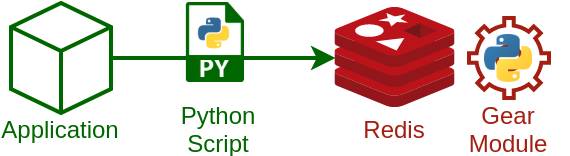
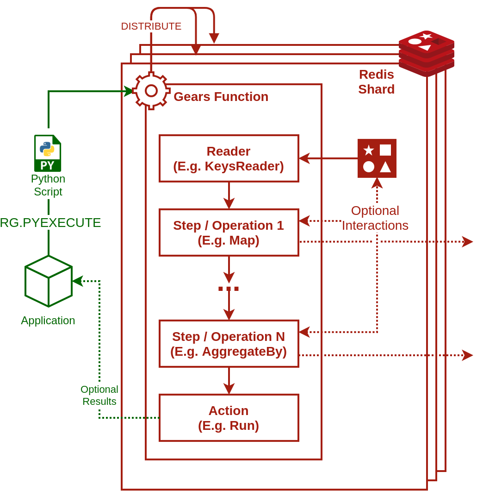

.. include :: banner.rst

.. _intro:

Introduction
============

RedGrease is a Python client and runtime package attempting to make it as easy as possible to create and execute :ref:`Redis Gears <intro_redis_gears>` functions on :ref:`Redis <intro_redis>` engines with the Redis Gears Module loaded.

    Overview

:ref:`RedGrease <intro_redgrease>` makes it easy  to write concise but expressive Python functions to query and/or react to data in Redis in realtime. The functions are automatically distributed and run across the shards of the Redis cluster, providing an excellent balance of performance of distributed computations and expressiveness and power of Python.

It may help you create:

- Advanced analytical queries,
- Event based and streaming data processing,
- Custom Redis commands and interactions,
- And much, much more...

... all written i Python and running distributed ON your Redis nodes.

The Gears functions may include and use third party dependecies like for example ``numpy``, ``requests``, ``SQLAlchemy``, ``gensim`` or pretty much any other Python package distribution you may need for your use-case.

.. _intro_redis:

Redis
-----

`Redis <https://redis.io/>`_ is a popular in-memory data structure store, used as a distributed, in-memory key–value database, cache and message broker, with optional durability.
Redis supports different kinds of abstract data structures, such as strings, lists, maps, sets, sorted sets, HyperLogLogs, bitmaps, streams, and spatial indexes. The project is developed and maintained by a project core team and as of 2015 is sponsored by `Redis Labs <https://redislabs.com/>`_. 
It is `open-source <https://github.com/redis/redis>`_ software released under a BSD 3-clause license.

.. _intro_redis_gears:

Redis Gears
-----------

`Redis Gears <https://redislabs.com/modules/redis-gears/>`_  is an official extension module for Redis, developed by `Redis Labs <https://redislabs.com/>`_, which allows for distributed Python computations on the Redis server itself.

From the `official Redis Gears site <https://redislabs.com/modules/redis-gears/>`_:

| *"RedisGears is a dynamic framework that enables developers to write and execute functions that implement data flows in Redis, while abstracting away the data’s distribution and deployment. These capabilities enable efficient data processing using multiple models in Redis with infinite programmability, while remaining simple to use in any environment."*

When the Redis Gears module is loaded onto the Redis engines, the Redis engine command set is extended with new commands to register, distribute, manage and run so called :ref:`Gear Functions <intro_gear_functions>`, written in Python, across across the shards of the Redis database. 

Client applications can define and submit such Python Gear Functions, either to run immedeately in batch or to be registered to be triggered on events, such as Redis keyspace changes, stream writes or external triggers. The Redis Gears module handles all the complexities of distribution, cooridnation, scheduling and execution of the Gear Functions.

    Redis Gears Processing Pipeline Overview

.. _intro_gear_functions:

Gear Functions
~~~~~~~~~~~~~~~

Gear Functions consists of a sequence steps, or operations, such as for example Map, Filter, Aggregate, GroupBy and more. 

These operations are parameterized with any Python functions, that you create according to your needs.

The the steps / operations are 'piped' togetrer by the Redis Gears runtime such that the output of of one step / operation becomes the input to the subsequent step / operation. 

The first step / operation of any Gear Function is always one of six "Reader", that defines what the initial input:

- :ref:`KeysReader <reader_keysreader>` : Redis keys and values.
- :ref:`KeysOnlyReader <reader_keysonlyreader>` : Redis keys.
- :ref:`StreamReader <reader_streamreader>` : Redis Stream messages.
- :ref:`ShardsIDReader <reader_shardsidreader>` : Shard ID.
- :ref:`PythonReader <reader_pythonreader>` : Arbitrary Python generator.
- :ref:`CommandReader <reader_commandreader>` : Command aguments from application client.

Readers can be parameterized to define which subset of data it should operate on, for example by specifying a pattern, for the keys or streams it should read. 

Depending on the reader type, Gear Functions can either be run immedeately, on demand, as batch jobs or in an event-driven manner by regestrig it to trigger automatically on various types of events.

Each shard of the Redis Cluster executes its own 'instance' of the Gear Function in parallell on the relevant local shard data, unless or until the data is finally collected and reduced to its final global result.

You can find more details about the interals of Gear Functions in the `official Documentation <https://oss.redislabs.com/redisgears/master/functions.html>`_.

.. _intro_redgrease:

RedGrease
---------

The RedGrease package provides a number of functionalities that facilitates writing and executing Gear Functions:

#. :ref:`Redis / Redis Gears client(s) <client>`.

    Extended versions of the `redis <https://pypi.org/project/redis/>`_ and `redis-py_cluster <https://github.com/Grokzen/redis-py-cluster>`_ clients, but with additional pythonic functions, mapping closely (1-to-1) to the :ref:`Redis Gears command set <client_gears_commands>` (e.g. `RG.PYEXECUTE`, `RG.GETRESULT`, `RG.TRIGGER`, `RG.DUMPREGISTRATIONS` etc), outlined in the `official Gears documentation <https://oss.redislabs.com/redisgears/commands.html>`_.

    .. code-block:: python
        :emphasize-lines: 6

        import redgrease

        gear_script = ... # Gear function string, a GearFunction object or a script file path.

        rg = redgrease.RedisGears()
        rg.gears.pyexecute(gear_script)  # <-- RG.PYEXECUTE

#. :ref:`Runtime functions <runtime>` wrappers. 

    The Redis Gears server `runtime environment <https://oss.redislabs.com/redisgears/runtime.html>`_ automatically loads a number of special functions into the top leve scope (e.g. ``GearsBuilder``, ``GB``, ``atomic``, ``execute``, ``log`` etc). 
    RedGrease provides placeholder versions that provide **&docstrings**, **auto completion** and **type hints** during development, and does not clash with the actual runtime.

    .. image:: ../images/basic_usage_hints.jpg

#. :ref:`Server-side Redis commands <red_commands>`.

    Allowing for **all** Redis (v.6) commands to be executed on serverside as if using a Redis 'client' class, instead of *manually* invoking the corresponding commmand string using ``execute()``. 
    It is basically the `redis <https://pypi.org/project/redis/>`_ client, but with ``execute_command()`` rewired to use the Gears-native ``execute()`` instead under the hood. 

    .. code-block:: python
        :emphasize-lines: 8, 11, 13

        import redgrease
        import redgrease.utils
        import requests

        # This function runs **on** the Redis server.
        def download_image(record):
            image_key = record.value["image"]
            if redgrese.cmd.hexists(image_key, "image_data"): # <- hexists
                # image already downloaded
                return image_key
            image_url = redgrease.cmd.hget(image_key, "url") # <- hget
            response = requests.get(image_url)
            redgrease.cmd.hset(  # <- hset
                image_key, 
                "image_data", 
                byte(response.content)
            )
            return image_key

        gear_fun = (
            redgrease.GearsBuilder(redgrease.ReaderType.KeysReader, "annotation:*")
            .map(redgrease.utils.record)
            .foreach(download_image, requirements=["requests"])
            .run()
        )

#. First class :ref:`GearFunction objects <readers>`.

    Inspired by the "remote builders" of the official `redisgears-py <https://github.com/RedisGears/redisgears-py>`_ client, but with some differences, eg:

    * Can be created without a Redis connection.

    * Several GearFuctions can reuse the the initial steps.

    * Can be executed in a few different convenient ways.
    
    * Requirements can be specified per step, instead of at execution.

    |br|

    .. code-block:: python

        import redgrease
        from redgrease.utils import as_is
        
        # Dummy processing of command argument
        def process(x):
            log(f"Processing argument '{x}'")
            return len(str(x))

        # GearFunction object
        gear = CommandReader().flatmap(as_is).map(process, requirements=["numpy"]).register(trigger="launch")

        # Redis client with Gears
        rg = redgrease.RedisGears()

        # Register the gear function on a cluster
        gear.on(rg) 
        # same as rg.gears.pyexecute(gear)

        # Trigger the function
        rg.gears.trigger("launch", "the", "missiles!")
        # [8, 3, 6]

#. :ref:`A Command Line Tool <cli>`.

    Helps running and or loading of Gears scripts onto a Redis Gears server. 
    Particularly useful for "trigger-based" CommandReader Gears.

    It also provides a simple form of 'hot-reloading' of Redis Gears scripts, by continously monitoring directories containing Redis Gears scripts and automatically 'pyexecute' them on a Redis Gear instance if it detects modifications. 

    The purpose is mainly to streamline development of 'trigger-style' Gear scripts by providing a form of hot-reloading functionality.

    .. code-block:: console
        
        redgrease --server 10.0.2.21 --watch scripts/

#. :ref:`A utils module <api_reference>`.

    Full of useful functions. For example:

    * A record ``record`` function  that can be used to transform the default `KeysReader` dict to an `Records` object with the appropriate attributes.

    * Parsers for common Python datatypes, serialized in Redis values.

    * Functional composition helper.

    * ... and more ...

        
#. :ref:`Syntactic sugar <sugar>`.

    For example:

    * A ``trigger`` :ref:`Function decorator <trigger_decorator>`, that makes creation and execution of ``CommandReader`` GearFunctions trivial, and providing a straight forward way of adding bespoke serverside Redis commands.

    * Named constants for special string values used by Redis Gears.

.. _intro_example_use_cases:

Example Use-Cases
-----------------

The possible use-cases for Redis Gears, and subsequently RedGrease, is virtually endless, but some commomn, or otherwise interesting use-cases include:

* Automatic Cache-miss handling.

    Make Redis automatically fetch and cache the requested resource if it isn't found, so that clients do not have to handle it.

* Automatic batched Write-Through / Write-Behind.
    
    Make Redis automatically write back updates to slower, high latency datastore, efficently using batch writes. Allowing clients to write high velocity updates uninterupted to Redis only 

    .. figure:: ../images/Gears_Example_2_white.png

        Write-Through / Write-Behind example

* Advanced Data Queries and Transforms.
    
    Perform "Map-Reduce"-like queries on Redis datasets.
    
* Stream event processing.
    
    Trigger processes automatically when data enters Redis.

* Custom commands.
    
    Create custom Redis commands with arbitrarily sophisticated logic, enabling featuers to virtually any platform with a Redis client implementation. 

.. _glossary:

Glossary
-----------

.. glossary::

    Gear Function
        Gear Function, written as two separate words, refer to any valid `Gear function, as defined in the Redis Gears Documentation <https://oss.redislabs.com/redisgears/master/functions.html>`_, regardless if it was constructed as a pure string, loaded from a file, or programattially built using RedGrease's ``GearFunction`` constuctors.
    

    GearFunction
        GearFunction, written as one word, refers specifically to RedGrease objects of type ``redgrease.GearFunction``.
        
        These are constucted programmatically using either ``redgrease.GearsBuilder``, any of the Reader clases such as ``redgrease.KeysReader``, ``redgrease.StreamReader``, ``redgrease.CommandReader`` etc, or function decorators such as ``redgrease.trigger`` and so on.
        
        It does **not** refer to Gear Functions that are loaded from strings, either explicitly or from files.

.. include :: footer.rst

.. |br| raw:: html

     